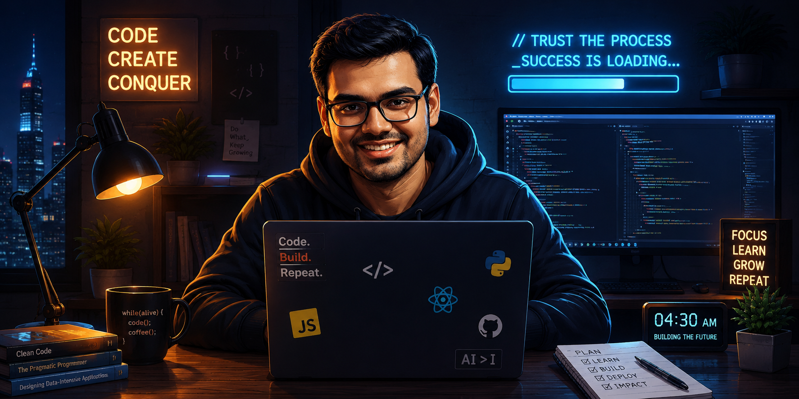

<div align="center">



<br><br>


# Hi, I'm Sushant Raj 👋

### Full Stack Developer in Progress • Building Toward AI Engineering

<p>
<a href="https://github.com/sushantsolves">

</a>
</p>

<p>

<a href="https://github.com/sushantsolves">

</a>

<a href="https://github.com/sushantsolves?tab=followers">

</a>

<a href="https://github.com/sushantsolves">

</a>

</p>

</div>

---

# 💫 About Me

```cpp
class SushantRaj {

public:

    string role = "B.Tech CSE Student";

    string currentFocus = "HTML • CSS • JavaScript";

    string futureGoal = "Full Stack Development → AI Engineering";

    string mindset = "Build • Learn • Improve • Repeat";

};
```

I'm a Computer Science student passionate about building software that solves real problems.

Right now, my focus is mastering the fundamentals of **Frontend Development** by building practical projects instead of just completing tutorials.

My long-term vision is to become a **Full Stack Developer** and eventually specialize in **Artificial Intelligence**, creating products that combine modern web technologies with intelligent systems.

---

# 🚀 Current Journey

```text
✅ Python

✅ Git

✅ GitHub

━━━━━━━━━━━━━━━━━━━━━━

🔵 HTML

🔵 CSS

🔵 JavaScript

━━━━━━━━━━━━━━━━━━━━━━

⏳ React

⏳ Node.js

⏳ Express.js

⏳ MongoDB

⏳ Docker

⏳ Cloud

⏳ Artificial Intelligence
```

---

# ⚡ Tech Stack

<div align="center">


<br><br>

### 📚 Currently Learning


</div>

---

# 🎯 2026 Goals

- 🚀 Build 20+ quality projects
- 🌐 Master HTML, CSS & JavaScript
- ⚛️ Learn React.js
- 🛠 Learn Backend Development
- ☁️ Deploy my own portfolio
- 🤝 Contribute to Open Source
- 🧠 Strengthen DSA & Problem Solving
- 🤖 Start my AI Engineering journey

---

# 📊 GitHub Analytics

<div align="center">


<br><br>


</div>

---

# 🚀 Featured Projects

> *Every project is another step toward becoming a better developer.*

<table>
<tr>

<td width="50%">

### 🛒 Amazon Clone

A responsive Amazon homepage clone built using only **HTML & CSS**.

**Tech**

HTML • CSS

🔗 **Repository**

https://github.com/sushantsolves

</td>

<td width="50%">

### 🌐 Portfolio Website

My personal portfolio where I'll showcase my journey, projects and skills.

**Tech**

HTML • CSS • JavaScript

🚧 Coming Soon

</td>

</tr>

<tr>

<td width="50%">

### 🐍 The Python Blueprint

A structured repository documenting my Python learning journey with notes, examples and projects.

**Tech**

Python

🔗 Repository

https://github.com/sushantsolves

</td>

<td width="50%">

### 💻 The Frontend Blueprint

A complete roadmap of my Frontend Development journey from HTML to modern JavaScript.

**Tech**

HTML • CSS • JavaScript

🔗 Repository

https://github.com/sushantsolves

</td>

</tr>

</table>

---

# 💭 My Coding Philosophy

> **"I don't measure progress by the number of tutorials I've watched.**
>
> **I measure it by the number of projects I've built, the bugs I've fixed, and the lessons I've learned from both."**

I believe consistency beats intensity.

Every commit, every project, and every bug solved brings me one step closer to becoming the engineer I aspire to be.

---

# 📈 Currently Building

```text
🟢 Amazon Clone

🟢 The Python Blueprint

🟢 The Frontend Blueprint

🟡 Personal Portfolio

⚪ React Projects

⚪ Full Stack Applications

⚪ AI Powered Projects
```

---

# 🧠 Currently Exploring

- Responsive Web Design
- Modern CSS
- JavaScript Fundamentals
- Problem Solving
- Clean Code Practices
- Git & GitHub Workflow

---


# 🗺️ My Roadmap

<div align="center">

| 2026 Journey | Status |
|---------------|--------|
| 🐍 Python | ✅ Completed |
| 🌱 Git & GitHub | ✅ Completed |
| 🎨 HTML | ✅ Completed |
| 🎨 CSS | 🔄 In Progress |
| ⚡ JavaScript | 🔄 In Progress |
| ⚛️ React | ⏳ Next |
| 🟢 Node.js | ⏳ Next |
| 🚀 Express.js | ⏳ Next |
| 🍃 MongoDB | ⏳ Next |
| ☁️ Cloud | ⏳ Future |
| 🤖 AI Engineering | 🎯 Ultimate Goal |

</div>

---

# 📚 Currently Learning

```text
Frontend Development
███████████░░░░░░░░░░ 55%

Backend Development
░░░░░░░░░░░░░░░░░░░░ 0%

Artificial Intelligence
░░░░░░░░░░░░░░░░░░░░ 0%

Problem Solving
███████░░░░░░░░░░░░░ 35%
```

---

# 🤝 Let's Connect

<div align="center">

<a href="https://www.linkedin.com/in/sushant-raj-44024a380">

</a>

<a href="mailto:sushantraj62060@gmail.com">

</a>

<a href="https://github.com/sushantsolves">

</a>

<a href="#">

</a>

</div>

---

# 🎯 2026 Goals

- ✅ Build a strong Frontend foundation
- 🔄 Complete JavaScript Mastery
- ⏳ Learn React.js
- ⏳ Learn Backend Development
- ⏳ Build Full Stack Projects
- ⏳ Deploy Personal Portfolio
- ⏳ Contribute to Open Source
- ⏳ Solve 500+ DSA Problems
- ⏳ Start AI & Machine Learning

---

# 📈 GitHub Activity

<div align="center">


</div>

---

# 🐍 Contribution Snake

> *Coming Soon...*

This section will automatically display an animated snake eating my GitHub contributions.

---

# 💡 Quote I Live By

<div align="center">

> **"Success isn't built in a day. It's built one commit at a time."**

</div>

---

<div align="center">

## Thanks for visiting! ❤️

If you like my work, consider ⭐ starring my repositories.

<br>


### **Sushant Raj**

**Building Tomorrow, One Commit at a Time 🚀**

</div>